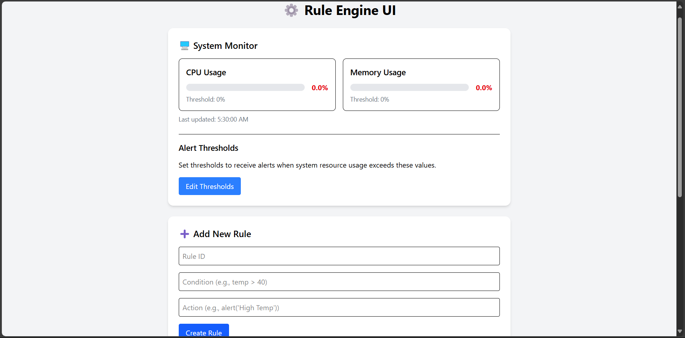
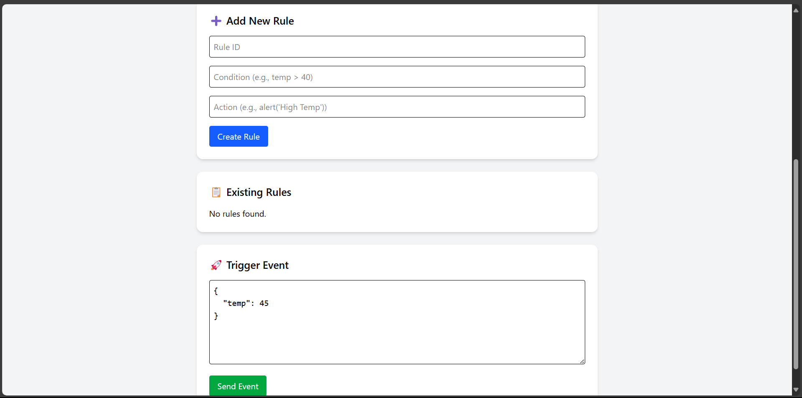

# 🧠 Lightweight Rule Engine for Automation

A lightweight, extensible rule engine built with Go and React. Users can define custom rules (like `if temp > 40 then alert`) and trigger actions in real time based on event inputs or live system metrics.

> 🔧 Built with Go (backend), SQLite (DB), React + Tailwind (frontend), and includes **real-time CPU & RAM monitoring**.

---

## 📦 Features

- ✅ Define custom rules with conditions and actions
- 💾 Persist rules using SQLite
- 🔄 Trigger rules by posting event data
- 🔍 Evaluate custom conditions with a basic DSL
- 💥 Execute corresponding actions (e.g., send alerts)
- 🌐 RESTful API with CORS support
- 🎛️ Real-time CPU & RAM usage tracking with alerts
- 🧩 Clean, responsive React UI

---

## 🧠 NEW: Real-time System Monitoring

The backend continuously tracks:

- 🖥️ **CPU usage**
- 🧠 **RAM usage**

If usage exceeds user-defined threshold values (e.g., `cpu > 80`, `ram > 70`), rules are evaluated and corresponding actions are triggered automatically.

### 🛠 Implemented Using

```bash
go get github.com/shirou/gopsutil/v3
```

This uses a background goroutine that fetches CPU and memory metrics at fixed intervals and runs them through the rule engine.

---

## 🧱 Tech Stack

| Layer      | Tech         |
| ---------- | ------------ |
| Backend    | Go (Golang)  |
| Monitoring | gopsutil     |
| Database   | SQLite       |
| Frontend   | React + Vite |
| Styling    | Tailwind CSS |

---

## 🛠️ Backend Setup (Go)

### 📁 Project Structure

```
rule-engine-backend/
├── main.go
├── rules/
│   ├── model.go
│   ├── store.go
│   └── handler.go
├── engine/
│   ├── evaluator.go
│   └── executor.go
├── db/
│   └── sqlite.go
├── monitoring/
│   ├──monitor.go
|   └──handler.go
├── go.mod
```

---

### 🔧 Setup

```bash
cd rule-engine-backend
go mod tidy
go run main.go
```

Runs server at `http://localhost:8080`.

---

## 🧪 API Endpoints

| Method | Endpoint | Description                  |
| ------ | -------- | ---------------------------- |
| GET    | /rules   | Get all rules                |
| POST   | /rules   | Create a new rule            |
| POST   | /events  | Send an event to match rules |

---

## 📡 Monitoring Example

#### 🧾 Rule:

```json
{
  "id": "high-cpu-alert",
  "condition": "cpu > 80",
  "action": "alert('CPU usage too high!')"
}
```

#### ⚙️ Live System Data:

The system will fetch CPU usage every 5 seconds and match it with your condition above.

---

## 🌐 Frontend Setup (React + Vite + Tailwind)

```bash
cd rule-engine-ui
npm install
npm run dev
```

Runs the UI at `http://localhost:5173`.

## 🖼️ UI Previews




---

## 🚀 Future Enhancements

- Webhook support for real actions (email, SMS, Slack)
- Graph/chart view of system metrics
- Multi-user rule isolation with authentication
- Priority and rule chaining
- Export/import rule sets

---

## 🙌 Author

Made with 💻 + ☕ by [Hariom Ingle]
